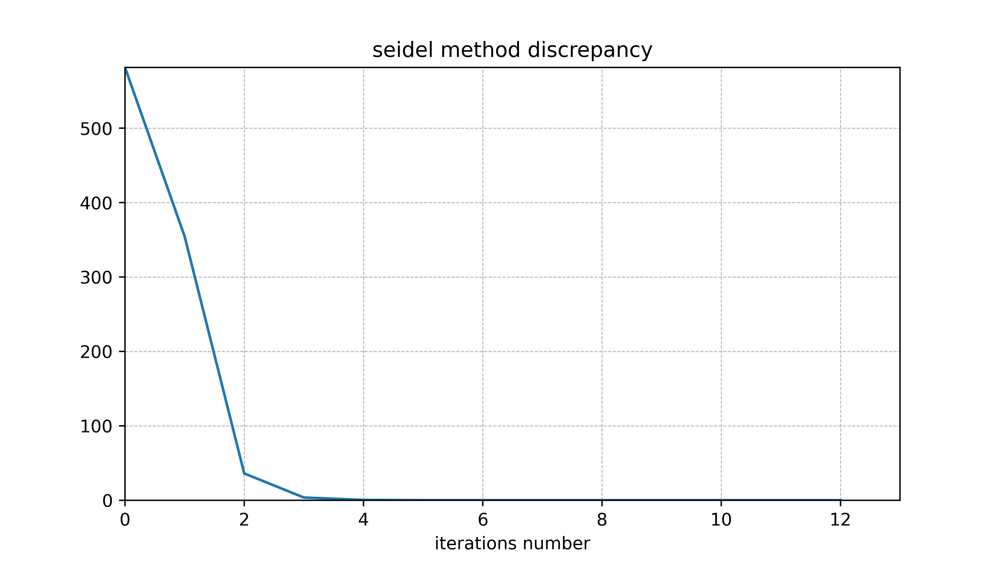
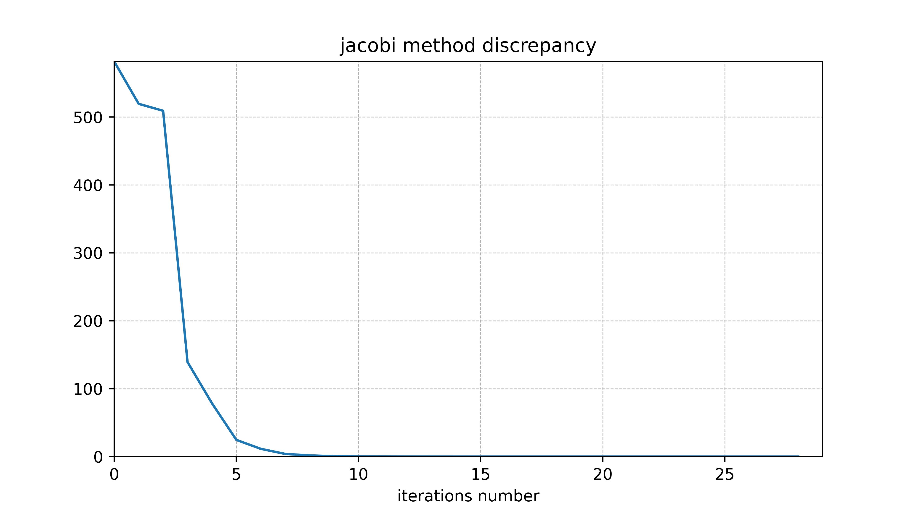
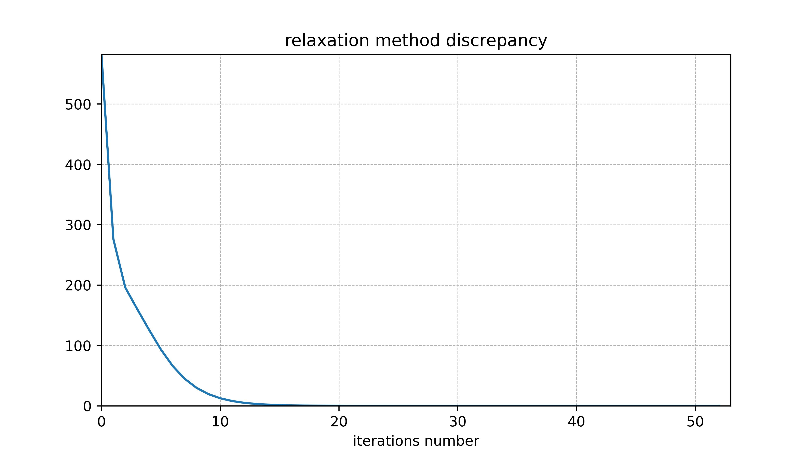

# Report of 2nd Laboratory
"***This world is like an unsolved linear equation – if you calculate the values of all variables, randomness will turn out to be a pattern.***" - Nika Ostozheva.

## Warning
Before using install `scipy`
```
pip install scipy
```

## Methodology

Various methods can be used to solve linear equations, and methods are given in this paper:

The accuracy criterion for all iterative methods is selected as $1 \cdot 10^{-8}$.

This work also uses Gauss and LU decomposition methods.

#### System of equations:

$$
\begin{flalign}
&
  \begin{cases} 
  b_1 x_1 + c_1 x_2 = f_1 \\
  a_2 x_1 + b_2 x_2 + c_2 x_3 = f_2 \\
  a_3 x_1 + b_3 x_2 + c_3 x_3 = f_3 \\
  ... \\
  a_n x_{n-1} + b_n x_n + c_n x_{n+1} = f_n \\
  p_1 x_1 + ... + p_{n+1} x_{n+1} = f_{n+1} \\
    \begin{cases}
    n = 99 \\
    a_i = c_i = 1 \\
    b_i = 10 \\
    p_i = 1 \\
    f_i = i
    \end{cases}
  \end{cases}
&
\end{flalign}
$$

#### Conclusion:

| Method     |             Error rate              | Iteration number |
| :--------- | :---------------------------------: | :--------------: |
| Gauss      | $\sigma_G    = 1.01 \cdot 10^{-13}$ |        1         |
| LU         | $\sigma_{LU} = 7.36 \cdot 10^{-14}$ |        1         |
| Seidel     | $\sigma_{S}  = 4.86 \cdot 10^{-9}$  |        13        |
| Jacobi     | $\sigma_{J}  = 8.87 \cdot 10^{-9}$  |        28        |
| Relaxation | $\sigma_{R}  = 8.92 \cdot 10^{-9}$  |        53        |

$$
\begin{flalign}
  & \text{If } b = Ax, \text{than}: &
\end{flalign}
$$

$$
\begin{flalign}
  & \text{Error rate(norm)}  = E_i = \parallel b - Ax_{i}\parallel_{3} = \sqrt{((b - Ax_{i}) \cdot (b - Ax_{i}))} = \sqrt{\sum_{k} \zeta_k^2} &
\end{flalign}
$$

$$
\begin{flalign}
  & k, i \in \mathbb{N} &
\end{flalign}
$$

>[Back to Methodology](#methodology)





>[Back to Methodology](#methodology)
