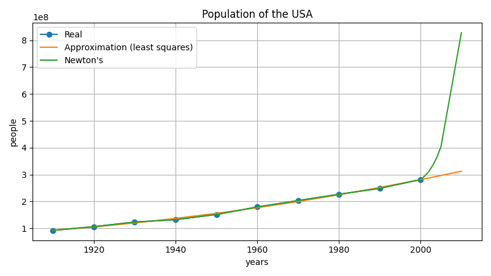

# Report of 4th Laboratory
## Methodology
In this laboratory is used the method of least squares to approximate population of the USA. 
## The method of least squares
$$
F = \sum_{i=0}^{n}{[y_i - (a \cdot x_i^2 + b \cdot x_i + c)]^2}
$$

$$
\begin{cases}
  \frac{\partial F}{\partial a} = 0 \\
  \frac{\partial F}{\partial b} = 0 \\
  \frac{\partial F}{\partial c} = 0
\end{cases}
$$

  Gives new system for calculating parameters:

$$
\begin{cases}
  a \cdot \sum\limits_{i}{x_i^4} + b \cdot \sum\limits_{i}{x_i^3} + c \cdot \sum\limits_{i}{x_i^2} = \sum\limits_{i}{y_i \cdot x_i^2} \\
  a \cdot \sum\limits_{i}{x_i^3} + b \cdot \sum\limits_{i}{x_i^2} + c \cdot \sum\limits_{i}{x_i} = \sum\limits_{i}{y_i \cdot x_i} \\
  a \cdot \sum\limits_{i}{x_i^2} + b \cdot \sum\limits_{i}{x_i} + c \cdot \sum\limits_{i}{1} = \sum\limits_{i}{y_i}
\end{cases}
$$

## The spline interpolation method

[Wiki](https://en.wikipedia.org/wiki/Spline_interpolation)
## Results
| <!-- -->       | <!-- --> | <!-- -->  | <!-- -->  | <!-- -->  | <!-- -->  | <!-- -->  | <!-- -->  | <!-- -->  | <!-- -->  | <!-- -->  |
| -------------- | -------- | --------- | --------- | --------- | --------- | --------- | --------- | --------- | --------- | --------- |
| **Population** | 92228496 | 106021537 | 123202624 | 132164569 | 151325798 | 179323175 | 203211926 | 226545805 | 248709873 | 281421906 |
| **Years**      | 1910     | 1920      | 1930      | 1940      | 1950      | 1960      | 1970      | 1980      | 1990      | 2000      |

| Method        | Population in 2010 |
| ------------- | ------------------ |
| Least squares | 312 470 336        |
| Newton's      | 827 906 509        |
| Spline        | 305 348 893        |

