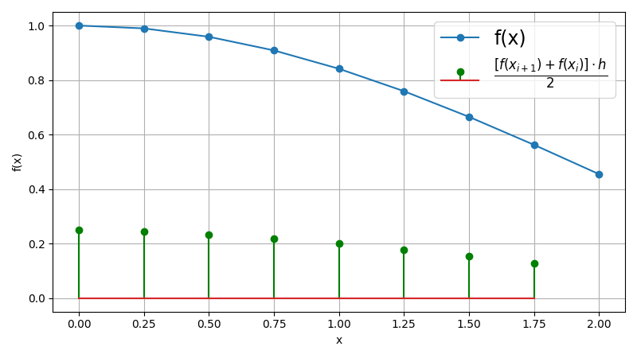

# Report of 5th Laboratory
## Description
In this laboratory are used different methods to calculate integral.

## Trapezoid method
$$
I_h = h \cdot \left[ \frac{f_0 + f_n}{2} +\sum_{i=1}^{n-1}{f_i} \right]
$$

## Simpson's method
$$
I_h = \frac{h}{3} \cdot \left[ f_0 + f_n + 4 \cdot \sum_{i=1}^{n/2}{f_{2i-1}} + 2 \cdot \sum_{i=1}^{n/2-1}{f_{2i}}\right]
$$

## Richardson extrapolation
$$
I^{p+1} = I^{p}_{h} + \frac{I_h^p - I_{2h}^p}{2^p - 1} + O(h^{p+1})\\
$$

$$
p = 2 - \text{trapezoid method} \\
p = 4 - \text{Simpson's method} \\
$$

## Data and Results

| <!-- --> | <!-- --> | <!-- --> | <!-- --> | <!-- --> | <!-- --> | <!-- --> | <!-- --> | <!-- --> | <!-- --> |
| -------- | -------- | -------- | -------- | -------- | -------- | -------- | -------- | -------- | -------- |
| x        | 0.00     | 0.25     | 0.50     | 0.75     | 1.00     | 1.25     | 1.50     | 1.75     | 2.00     |
| $f_x$    | 1.000000 | 0.989616 | 0.958851 | 0.908852 | 0.841471 | 0.759188 | 0.664997 | 0.562278 | 0.454649 |

**Trapezoid method: h - 1.603144, 2h - 1.596322**
**Trapezoid method with correction (Richardson extrapolation): 1.605419**
**Simpson's method = 1.605419**
