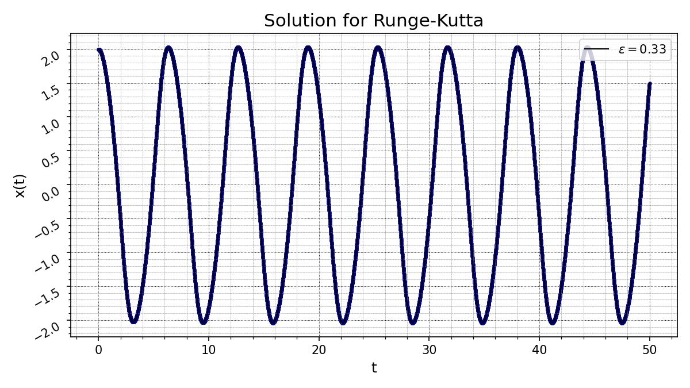
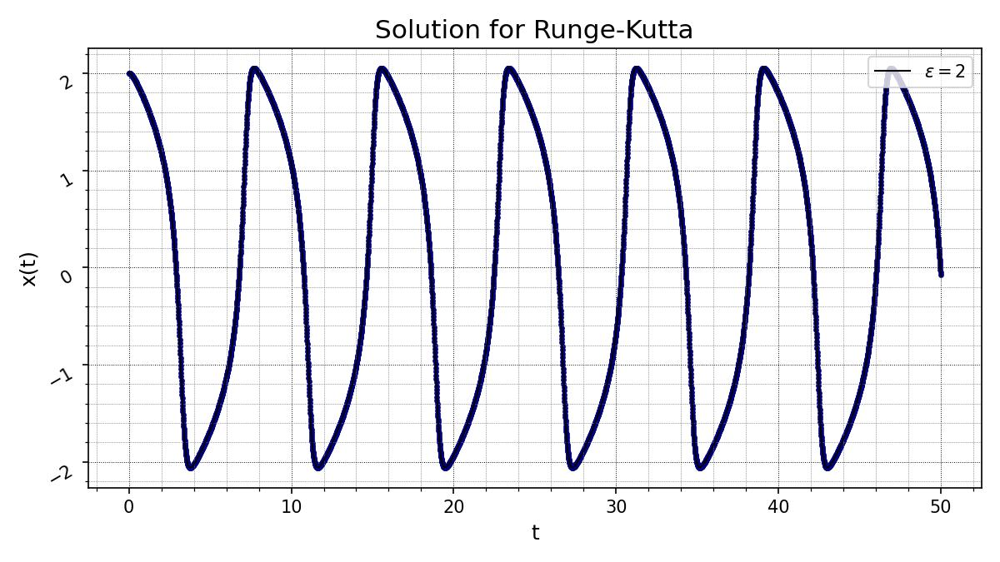

# Report of 7th Laboratory

## Description
Solve a system of ordinary differential equations (ODEs) by:

1) Runge-Kutta methods;
2) Adams methods;
3) Backward differentiation formula (BDF).

The example to which these methods were applied is well-known Van der Pol equation
$$
\begin{equation*}
    \ddot{y} + \epsilon(y^2 - 1)\dot{y} + y = 0
\end{equation*}
$$
We have to transform the equation of the 2nd order into a system of equations of the 1st order to be able to apply aforementioned methods. It may be done the following way:
$$
\begin{cases}
    \dot{x} = z \\
    \dot{z} = \epsilon(1 - x^2)z - x
\end{cases}
$$
## Runge-Kutta

## Adams

## BDF

## Another value of $\epsilon$

