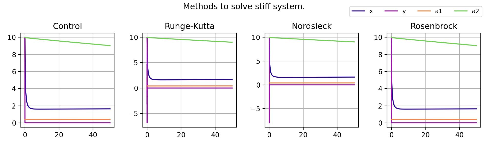

# Report of 8th Laboratory

## Description
Solve a stiff system differential equations.

$$
\begin{cases}
    \dot{x} = x(2a_1-0,5x-a_1^2a_2^{-2}y) \\
    \dot{y} = y(2a_2-0,5y-a_1^{-2}a_2^{2}y \\
    \dot{a_1} = \epsilon(2-2a_1a_2^{-2}y) \\
    \dot{a_2} = \epsilon(2-2a_2a_1^{-2}x) \\
    \epsilon = 0,001 \\
    x_0 = 10 \\
    y_0 = 10 \\
    a_{10} = 0.4 \\
    a_{20} = 10 \\
\end{cases}
$$

Distinctive characteristics of the system:

$$
\begin{cases}
    \epsilon \leq 0,01 \\
    0 \leq x_0 \leq 40 \\
    0 \leq y_0 \leq 40 \\
    a_{10} \ll 1 \\
    a_{20} = 10 \\
\end{cases}
$$

## Runge-Kutta
Coeff for the 3rd order are below:

All possible coeff configuration can see [here](https://en.wikipedia.org/wiki/List_of_Runge%E2%80%93Kutta_methods).

## Rosenbrock methods

We will implement Rosenbrock scheme with complex coefficients :

$$
\begin{equation*}
    \left(\textbf{E} - \frac{1 + i}{2}\tau\textbf{J}\right)\textbf{w} =
    \textbf{f}\left(t_n + \frac{\tau}{2}, \textbf{x}_n\right),
\end{equation*}
$$

$$
\begin{equation*}
    {x}_{n + 1} = {x}_n + \tau \cdot Re{w}
\end{equation*}
$$

where 
$\textbf{J}$
is jacobian of the system.

## Nordsieck representation methods

$$
\begin{cases}
    \textbf{z}_{n+1} = \textbf{P}\textbf{z}_n + \textbf{l}(\tau \textbf{f} - \textbf{e}_1\textbf{P}\textbf{z}_n) \\
    \textbf{f} = \textbf{f} (t^{n+1}, x^{n+1})
\end{cases}
$$

$$
\begin{equation*}
    \textbf{P} = (P_{ij})^{(k + 1) \times (k + 1)} :\
    P_{ij} =
    \begin{cases}
        C_i^{j}, & i \leq j \\
        0, & i > j
    \end{cases}
\end{equation*}
$$

$$
\begin{equation*}
    \textbf{z}_n =
    \begin{pmatrix}
        x_n^{0}         & \cdots & x_n^{m} \\
        \tau x_n^{0(1)} & \cdots & \tau x_n^{0(1)} \\
        \cdots          & \cdots & \cdots \\
        \frac{\tau^k}{k!}x_n^{0(k)} & \cdots & \frac{\tau^k}{k!}x_n^{m(k)}
    \end{pmatrix}
\end{equation*}
$$

$$
\begin{equation*}
    \textbf{l} = (l_0, l_1, \ldots, l_k)^T
\end{equation*}
$$

$$
\begin{equation*}
    {\textbf{e}}^{1} = (0, 1, 0, \ldots, 0)_{k + 1}
\end{equation*}
$$

## Results

