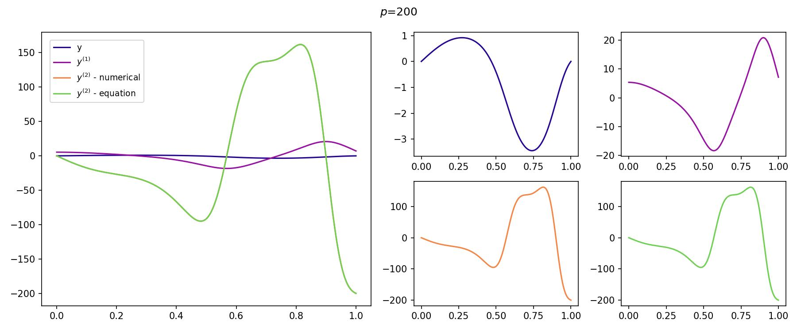
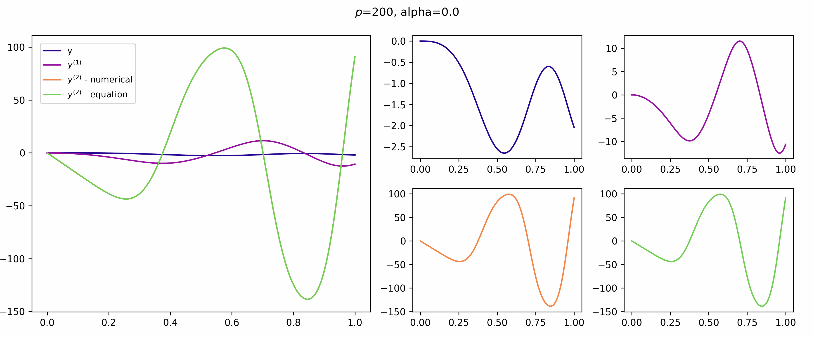
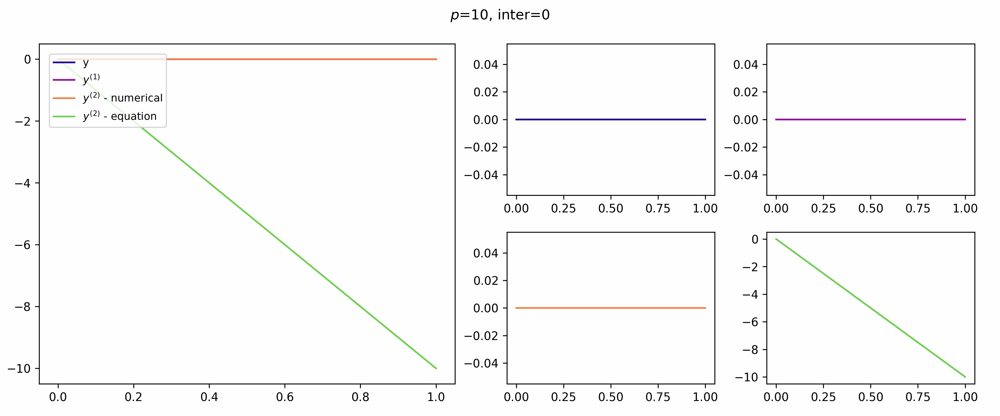
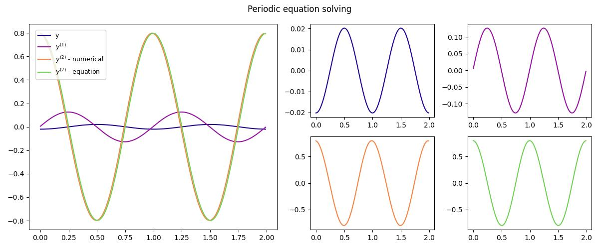

# Report of the 9th Laboratory

## Description
In this paper, shooting and quasi-linear methods are used to solve the boundary value problem. And the solution of the problem with periodic solutions is also considered. The three-point run method, also known as the Thomas method, is used to solve the problems for periodic solutions and for quasi-linear method.

$$ 
\begin{cases}
y''+pxcos(y)=0,\\
y(0) = 0, y(1) = 0
\end{cases}
\rightleftarrows 
\begin{cases}
y' = \psi, \\
\psi' = -pxcos(y),\\
\psi(0) = \alpha,\\
y(1) = 0
\end{cases}
$$

This system should be resolved by Runge-Kutta method

To solve the last one system, the following representation is used:

$$
\begin{cases}
y″- P^ {2}(x)y=f(x),\\
P^ {2} (x)=10+  \sin  2  \pi x,\\
f(x)= \cos 2 \pi x
\end{cases}
$$

$$
\begin{cases}
 \frac {y_ {1}-2y_ {0}+y_ {N-1}}{h^ {2}} - P^ {2}  (0)  y_ {0}  =f(0),\\
 \frac {y_ {n+1} -2y_ {n}+y_ {n-1}}{h^ {2}} - P^ {2} (nh)  y_ {n}  =f(nh),n=1,2,  \cdots ,N-2.\\
 \frac {y_0-2y_{N-1}+y_{N-2}}{h^2} - P^ {2} (1-h) y_ {N-1}  =f(1-h)\\
\end{cases}
$$

## Shooting method
In numerical analysis, the shooting method is a method for solving a boundary value problem by reducing it to an initial value problem. It involves finding solutions to the initial value problem for different initial conditions until one finds the solution that also satisfies the boundary conditions of the boundary value problem.

More information [here](https://en.wikipedia.org/wiki/Shooting_method).

$$
\begin{cases}
 \frac {du}{dt} =f(u);t  \in [0,L] ,\\
F[u(0),u(L)]=0,\\ 
u,f,F \in R^ {n} 
\end{cases}
$$

$$
\begin{cases}
\frac{du}{dt}=f(u),\\
u(0)=\alpha
\end{cases}
$$

$$ F( \alpha ,u(L, \alpha ))=0 \rightleftarrows F( \alpha )=0$$

---

## Quasi-linearization method (Newton's method)

$$
\begin{cases}
\frac{d^ {2}u}{t+2}=f(u),\\
u(0)=  U_ {1},\\
u(L)=U.
\end{cases}
$$

$$
\begin{cases}
  \frac {u_{n-1}-2u_ {n}+u_ {n+1}}{\tau^ {2}}  =f(u_ {n}), n=1,  \cdots  N-1,\\
  u_ {0}  =  U_ {1}  ,  u_ {N}  = U_ {2}  ,\tau=  \frac {L}{N}  .
\end{cases}
$$

$$
f( u_ {n}^ {i+1} ) \approx f( u_ {n}^ {i} )+ f_ {u} '( u_ {n}^ {i} )( u_ {n}^ {i+1} - u_ {n}^ {i} )
$$

$$
\frac {u_ {n-1}^ {i+1}-2u_ {n}^ {i+1}+u_ {n+1}^ {i+1}}{-2} =f( u_ {n}^ {i} )+f'(  u_ {n}^ {i} )( u_ {n}^ {i+1} - u_ {n}^ {i})
$$

$$
u_ {n}^ {0} =  \varphi ( t_ {n} ),i=0,1,...
$$

$$\varphi(0) = U_ {1}, \varphi(L) = U_ {2}$$

---

## Tridiagonal matrix algorithm
In numerical linear algebra, the tridiagonal matrix algorithm, also known as the Thomas algorithm (named after Llewellyn Thomas), is a simplified form of Gaussian elimination that can be used to solve tridiagonal systems of equations. A tridiagonal system for n unknowns may be written as

$$
 a_ {i} x_ {i-1} + b_ {i} x_ {i} +  c_ {i} x_ {i+1} = d_ {i} 
$$

In some situations, particularly those involving periodic boundary conditions, a slightly perturbed form of the tridiagonal system may need to be solved:

$$
\begin{cases}
a_ {1} x_ {n} + b_ {1}  x_ {1} + c_ {1} x_ {2} =  d_ {1} \\
a_ {i} x_ {i-1} + b_ {i} x_ {i} + c_ {i} x_ {i+1} = d_ {i} ,i=2, \cdots ,n-1\\
a_ {n} x_ {n-1} + b_ {n}  x_ {n} + c_ {n} x_ {1}=  d_ {n} \\
\end{cases}
$$

More information [here](https://en.wikipedia.org/wiki/Tridiagonal_matrix_algorithm).

---

